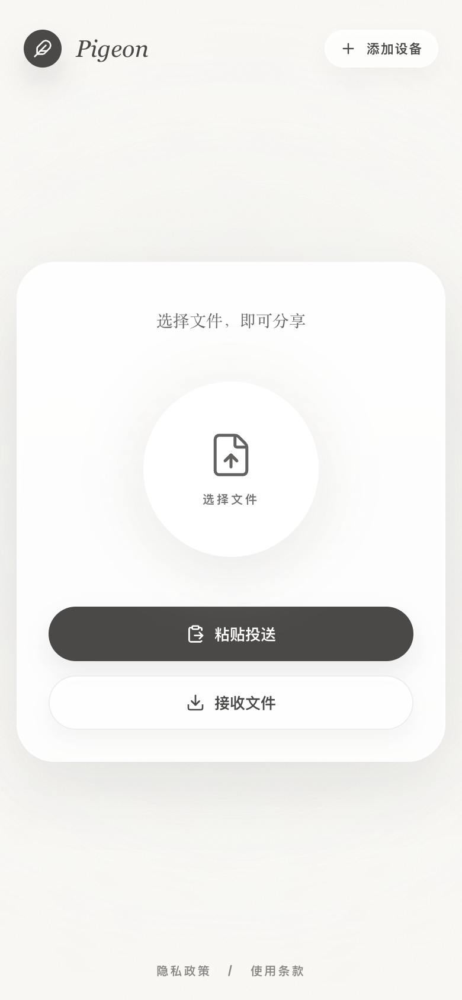
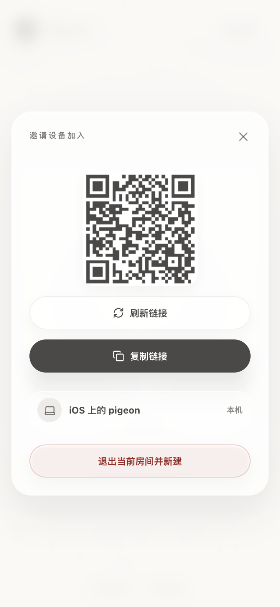
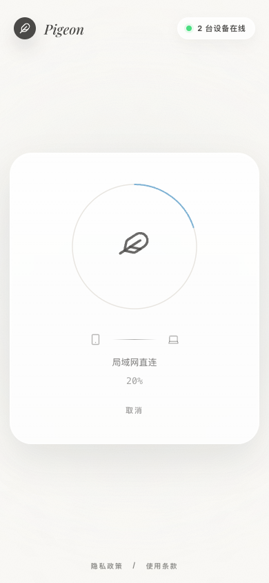

# 🐦 Pigeon

极简的跨平台端到端加密文本与文件投递工具。

无需账号，无需安装，打开浏览器即可在任意设备间传输文件和文本。

## 界面预览

| 主页 (Home) | 房间界面 (Room) | 传输界面 (Transfer) |
| :---: | :---: | :---: |
|  |  |  |

### 动态演示

<video src="docs/screenshots/file_transfer.mp4" controls muted loop playsinline width="100%"></video>


## 特性

- **端到端加密** — 基于 ECDH (P-256) 密钥协商 + AES-256-GCM 加密，服务器无法窥探传输内容
- **P2P 直连** — 通过 WebRTC 建立点对点连接，自动检测 LAN / 直连 / TURN 中继路由
- **断点续传** — 连接中断后自动从已接收的分片处恢复，无需重新传输
- **两种模式**
  - **房间模式** — 在自己的在线设备间定向投递
  - **配对模式** — 生成 6 位提取码或链接，分享给他人即可传输
- **PWA 支持** — 可安装到桌面/主屏，支持离线缓存
- **拖拽 & 粘贴** — 支持拖放文件、剪贴板粘贴、文件选择器
- **现代 UI 设计** — 毛玻璃效果 (Glassmorphism)、流畅的微交互、自适应深浅色系统图标

## 技术栈

| 层 | 技术 |
|---|---|
| 前端 | React 19 · TypeScript · Vite 7 · Motion (Framer Motion) |
| 后端 | Cloudflare Workers · Hono · Durable Objects · D1 (SQLite) |
| 传输 | WebRTC (RTCDataChannel) · WebSocket 信令 |
| 加密 | Web Crypto API — ECDH P-256 · AES-256-GCM |

## 项目结构

```
pigeon/
├── index.html              # SPA 入口
├── vite.config.ts          # Vite + Cloudflare 插件配置
├── wrangler.jsonc          # Workers / D1 / Durable Objects 配置
├── src/
│   ├── main.tsx            # React 入口 + Service Worker 注册
│   ├── App.tsx             # 主应用组件
│   ├── styles.css          # 样式（毛玻璃设计）
│   ├── shared/
│   │   └── protocol.ts     # 共享协议类型与消息校验
│   └── lib/
│       ├── api.ts          # HTTP API 客户端
│       ├── crypto.ts       # ECDH + AES-GCM 加解密
│       ├── peerTransfer.ts # WebRTC 文件传输（发送/接收）
│       ├── peerFrame.ts    # 二进制分帧（加密分片）
│       ├── signaling.ts    # WebSocket 信令
│       ├── filePackage.ts  # 文件打包与清单生成
│       ├── receiveSink.ts  # 文件接收（目录选择 / 下载）
│       └── ...             # 工具函数与辅助模块
├── worker/
│   ├── index.ts            # Hono API 路由
│   ├── durable.ts          # PairRoom + DeviceRoom Durable Objects
│   └── crypto.ts           # 服务端加密辅助
├── migrations/             # D1 数据库迁移
└── public/
    ├── manifest.webmanifest
    ├── favicon.svg         # 网站标签页图标 (自适应暗色模式)
    ├── sw.js               # Service Worker
    └── pigeon-icon.svg     # PWA 桌面主屏图标
```

## 快速开始

### 前置条件

- [Node.js](https://nodejs.org/) (>= 18)
- npm

### 本地开发

```bash
# 安装依赖
npm install

# 初始化本地数据库
npm run db:migrate

# 启动开发服务器（Vite + Workers 本地模拟）
npm run dev
```

访问 `http://localhost:5173` 即可使用。

### 构建与部署

```bash
# 类型检查 + 生产构建
npm run build

# 部署到 Cloudflare Workers
npm run deploy
```

部署需要先通过 `wrangler login` 登录 Cloudflare 账号。

### TURN 中继配置

文件传输使用 WebRTC DataChannel。仅配置 STUN 时，同局域网或部分家庭网络可以直连，但手机网络、公司网络、对称 NAT / CGNAT 下通常需要 TURN 中继，否则进度可能停在 0%。

推荐使用 Cloudflare Realtime TURN。先在 Cloudflare Dashboard 创建 TURN key，然后给 Worker 配置短期凭证生成所需变量：

```bash
npx wrangler secret put TURN_KEY_ID
npx wrangler secret put TURN_KEY_API_TOKEN
```

可选配置：

```bash
npx wrangler secret put TURN_TTL_SECONDS
```

`TURN_TTL_SECONDS` 默认 86400 秒，最大会被限制为 172800 秒。浏览器不会拿到长期 TURN key，`/api/turn` 会由 Worker 动态生成短期 `iceServers`。

也可以使用其他 TURN 服务作为静态兜底：

```bash
npx wrangler secret put TURN_URLS
npx wrangler secret put TURN_USERNAME
npx wrangler secret put TURN_CREDENTIAL
```

## 可用脚本

| 命令 | 说明 |
|---|---|
| `npm run dev` | 启动开发服务器（局域网可访问） |
| `npm run build` | 生产构建 |
| `npm run preview` | 预览生产构建 |
| `npm run deploy` | 部署到 Cloudflare Workers |
| `npm run db:migrate` | 执行本地 D1 数据库迁移 |
| `npm run db:migrate:remote` | 执行线上 D1 数据库迁移 |
| `npm run test` | 运行测试 |
| `npm run typecheck` | TypeScript 类型检查 |

## 工作原理

### 房间模式（自用设备间传输）

1. 首次访问时，设备生成 ECDH 密钥对（私钥存储于本机 IndexedDB），并在服务端创建房间
2. 通过邀请链接将其他设备加入房间
3. 所有在线设备通过 WebSocket (Durable Object) 保持连接
4. 发送文件时，向当前在线设备定向发送接收请求，设备间通过 ECDH 协商共享密钥，经 WebRTC 加密传输

### 配对模式（与他人分享）

1. 发送方创建提取码（6 位字母数字，10 分钟有效）
2. 接收方输入配对码或打开 `/?code=XXXXXX` 链接
3. 双方通过 WebSocket 交换公钥，ECDH 协商加密通道
4. 文件经 WebRTC DataChannel 端到端加密传输

### 加密流程

```
发送方                                    接收方
  │                                         │
  ├─ 生成 ECDH 密钥对                        ├─ 生成 ECDH 密钥对
  │                                         │
  ├─ 交换公钥（经信令服务器）──────────────────►│
  │                                         │
  ├─ ECDH 派生 AES-256-GCM 密钥              ├─ ECDH 派生 AES-256-GCM 密钥
  │                                         │
  ├─ 分片 → 每片独立 IV + AES-GCM 加密 ──────►│ 解密 → 校验 SHA-256 → 写入文件
  │                                         │
  └─ 断线后从已接收分片处恢复 ◄────────────────┘ 上报已接收进度
```

> 注：传输内容不会明文经过服务器。当前版本默认信任信令服务器正确转发双方公钥；如需抵御被篡改的信令服务，可在后续版本加入短码/指纹确认。

## API 端点

| 端点 | 方法 | 说明 |
|---|---|---|
| `/api/rooms` | POST | 创建房间，注册设备 |
| `/api/rooms/join` | POST | 通过邀请加入房间 |
| `/api/rooms/invites` | POST | 生成房间邀请链接 |
| `/api/pairs` | POST | 创建配对码 |
| `/api/turn` | GET | 获取 ICE 服务器配置 |
| `/ws/room/:roomId` | GET | 房间 WebSocket 信令 |
| `/ws/pair/:code` | GET | 配对 WebSocket 信令 |

## License

MIT
